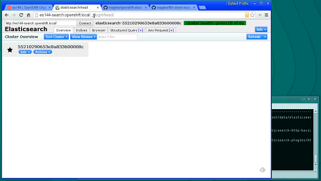
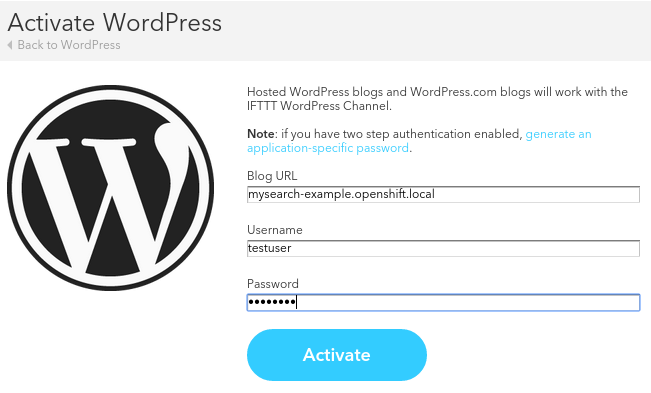
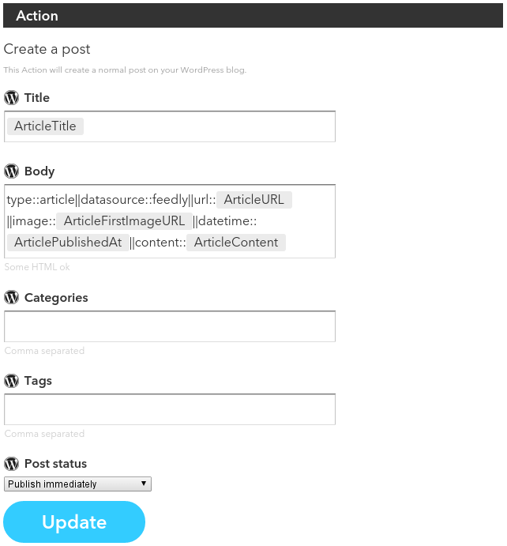

# IFTTT-Elasticsearch

**Index all your stuff with IFTTT and Elasticsearch.**

With this application you can connect your personal [Elasticsearch-Server](https://www.elastic.co) to [IFTTT](https://ifttt.com) using the Wordpress-Channel. It imitates the required XML-RPC-Interface of a Wordpress-Blog. 

**_Features_**

* Material Design UI
* Tested on [OpenShift PaaS](https://openshift.redhat.com)

## Get IFTTT-Elasticsearch Up and Running on OpenShift

_(Screencast, ~15MB, 720p MP4)_

## Configure IFTTT Channel and Recipes

### Configure the Wordpress-Channel

### Configure a Recipe

#### Available types and fields

See [Types (JSON)](https://github.com/magdev/ifttt-elasticsearch/blob/dev/config/elasticsearch/types.json)

#### Syntax for the description field

To pass extended data to elasticsearch we need a special syntax in the description-field. You can pass Key-Value-Pairs using a double pipe as pair-delimiter and a double colon as key-value-delimiter.

## Currently tested channels

* Feedly
* Youtube
* Photo from Android-Phone
* Github Issues
* RSS-Feed
* Google Calendar

## To-Do

* Write tests
* Write documentation
* Imput validation
* UI improvements
* Security Checkup
* Test more IFTTT channels
* Scrape the entire page on index
* More translations
* Index management
* maintenance scripts
* Implement tags
* Add more semantics to the frontend

## License

Copyright (c) 2015 Marco Grätsch  
Licensed under the [MIT license](LICENSE.md).
